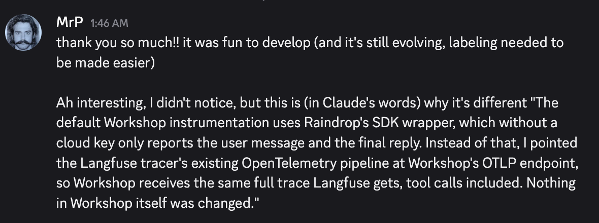
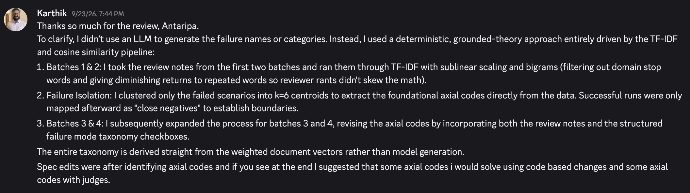

# HW4 selected references

**Assignment:** [HW4 handout](https://github.com/ai-evals-course/cartwheel-homeworks/blob/main/homework/module-2/hw4.md)

HW4 uses human trace review to discover, define, revise, and bound failure modes. These references show thoughtful ways to organize the review process and preserve the evidence behind a taxonomy.

## Luca Pazzi

- **Walkthrough:** [Watch the video](https://www.loom.com/share/8ef640b1280d4f7f8e42304aa9c44832)
- **Code and analysis:** [View pull request #4](https://github.com/mrpozzi/cartwheel-homeworks/pull/4)

### Why it was selected

Luca provides the strongest complete evidence package in this set: 121 reviewed traces, seven failure modes, current judgments, suggestion and revision history, specification changes, and a custom review interface. The interface groups a full conversation, makes tool details expandable, supports comments and tags, and shows review state across the queue.

His failure taxonomy also demonstrates useful boundary work. For example, he separates duplicate escalation from cases where human review is genuinely needed, then records the resulting policy clarification.

### What to study

- Designing a review interface around repeated annotation work
- Preserving judgment and taxonomy history while definitions evolve
- Using positive examples and close negatives to sharpen a failure boundary
- Connecting a repeated failure to a concrete specification change
- Checking the final batch for saturation rather than stopping after an arbitrary count

### Optional Workshop note

Workshop was optional for HW4 and was not the basis for selecting this submission. Luca nevertheless solved an instructive observability problem: he routed the existing Langfuse OpenTelemetry trace pipeline to Workshop’s OTLP endpoint. This allowed the local Workshop view to receive the full trace, including tool calls, without changing Workshop itself.

Luca shared this clarification after the review:

## Karthik Balasubramanian

- **Walkthrough:** [Watch the video](https://www.loom.com/share/1d4f535e1cce47db9557f6846d2fc0fd)
- **Code and analysis:** [View the commit](https://github.com/karthikBalasubramanian/cartwheel-homeworks/commit/903e1d176e8d2c71bbead28bd595771cc36b3576)

### Why it was selected

Karthik explores an alternative to using an LLM to organize review notes. He represents notes with TF-IDF using bigrams and sublinear term frequency, clusters failed scenarios into six groups, and later maps successful runs as close negatives. In subsequent batches, he combines new notes with the evolving structured taxonomy.

This is a useful example of deterministic tooling supporting grounded-theory analysis. The vectors and clusters help retrieve and organize related observations; a human still interprets the groups, defines the failure semantics, checks boundaries, and curates the final taxonomy.

Karthik shared this summary of his process after the review:

### What to study

- Using deterministic similarity to make a large note set easier to inspect
- Clustering failures before attaching successful close negatives
- Preventing repeated wording in long notes from dominating similarity
- Keeping discovery aids separate from the human decision that defines a failure mode
- Deciding which modes suggest code changes and which need evaluators
